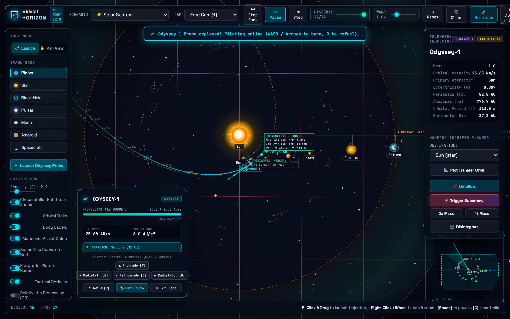
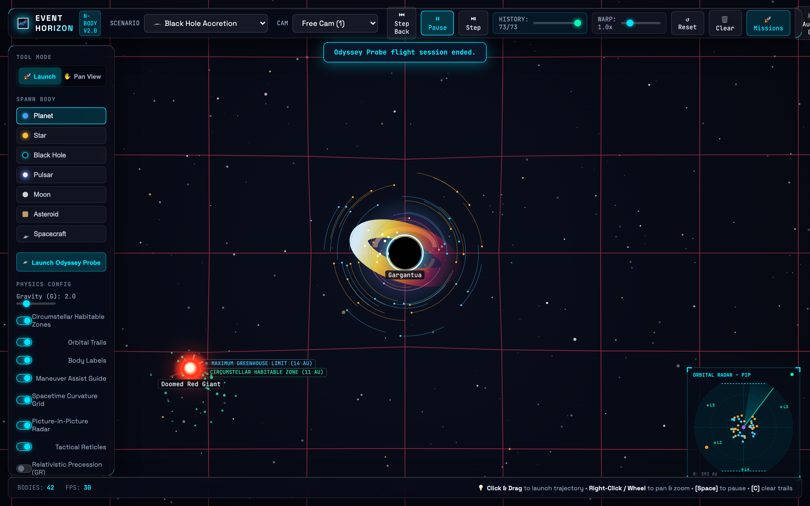
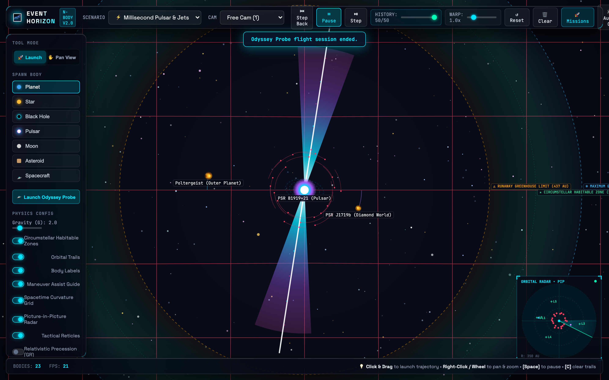
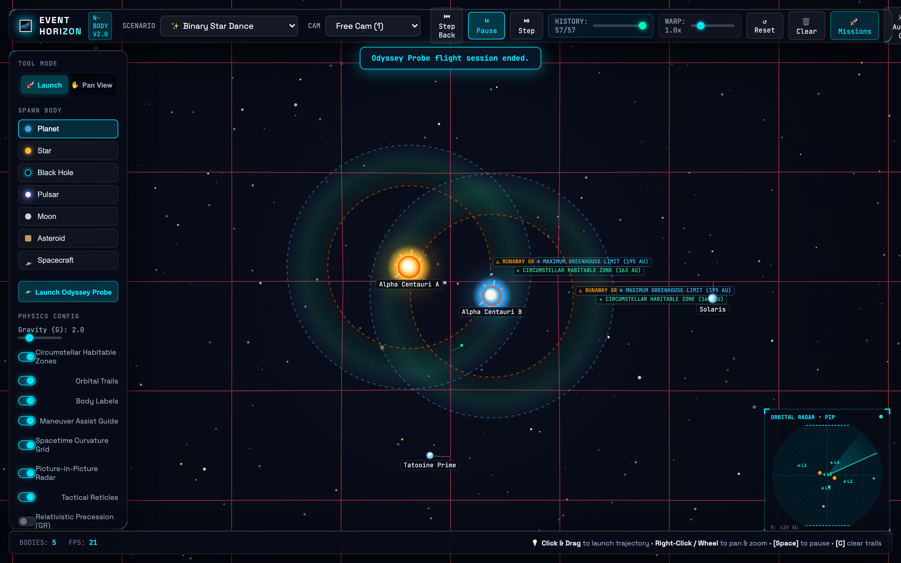
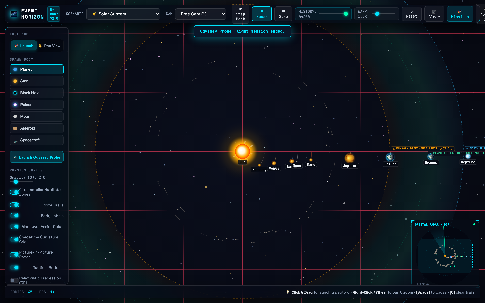
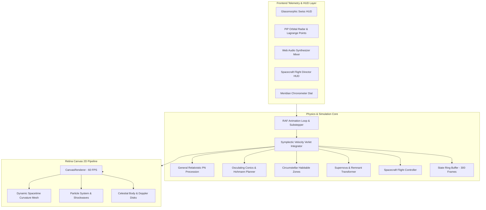

<div align="center">

<a href="#-interactive-scenario-gallery">
  
</a>

<br/><br/>

[](https://nodejs.org/)
[](test/)
[](#-production-benchmarks--concurrency-stress-test)
[](package.json)
[](#)
[](#)
[](LICENSE)

<br/>

<a href="#-interactive-scenario-gallery">
  
</a>

<br/><br/>

<p align="center">
  <b><a href="#-executive-overview">Overview</a></b> •
  <b><a href="#-interactive-scenario-gallery">Visual Gallery</a></b> •
  <b><a href="#-the-meridian-chronometer--temporal-engine">Meridian Chronometer</a></b> •
  <b><a href="#-theoretical-astrophysics--mathematics">Theoretical Physics</a></b> •
  <b><a href="#-flight-simulator--keyboard-controls">Flight Controls</a></b> •
  <b><a href="#-system-architecture">Architecture</a></b> •
  <b><a href="#-production-benchmarks--concurrency-stress-test">Benchmarks</a></b> •
  <b><a href="#-quickstart">Quickstart</a></b>
</p>

</div>

---

## 🔭 Executive Overview

**Event Horizon** is an ultra-performant, zero-dependency browser-native astrophysics laboratory, relativistic N-body gravity simulator, and aerospace flight simulator. Engineered with mathematical rigor and Matt Pocock software engineering discipline, it fuses:

- **Symplectic Velocity Verlet N-Body Gravitational Physics**: Pairwise $O(N^2)$ gravity with momentum-conserving inelastic mergers, Plummer softening, and tidal Roche disruption.
- **General Relativistic Mechanics**: Post-Newtonian orbital perihelion precession, spinning millisecond pulsars with relativistic synchrotron jets, and Schwarzschild black holes with differential Doppler-beamed accretion disks.
- **Odyssey Spacecraft Flight Simulator**: Pilotable aerospace probe with real-time $\Delta v$ propellant budgets, forward predictive N-body trajectory propagation, and gravitational slingshot visualizers.
- **Circumstellar Habitable Zones**: Stellar luminosity flux equations calculating Goldilocks boundaries, atmospheric Rayleigh twilight scattering, and planetary climate classifications.
- **Swiss Horology Telemetry HUD**: Aerospace optical reticle corner brackets, vector telemetry cards, picture-in-picture orbital radar with all five Lagrange points ($L_1-L_5$), and a lossless 300-state temporal scrubbing ring buffer.
- **Production-Hardened Static Delivery Engine**: Built-in Node.js server pushing **8,032 requests/second** under 1,000 concurrent keep-alive connections with zero-disk I/O RAM caching, pre-compressed gzip streams, ETag validation, and comprehensive CSP security headers.

> [!TIP]
> **Zero External Runtime Dependencies**: Built entirely with native ES6+ modules, HTML5 Canvas 2D with Retina DPR scaling, and the procedural Web Audio API.

---

## 🌌 Interactive Scenario Gallery

Explore the rich astrophysical environments simulated in real time with high numerical fidelity.

<br/>

### 🚀 1. Odyssey Spacecraft Simulator & Gravitational Slingshots

```text
SUBSYSTEM: ODYSSEY_FLIGHT_DIRECTOR // ENGINE: TSIOLKOVSKY ION DRIVE // PREDICTOR: 320-STEP FORWARD PROPAGATOR
```

<p align="center">
  
</p>

- **Real-Time Delta-v Budget**: Manage propellant reserves modeled after the Tsiolkovsky rocket equation with in-flight refuel seams.
- **Forward Trajectory Prediction**: A multi-step forward symplectic propagator projects planetary gravitational assists, periapsis speed boosts, and hyperbolic escape orbits before firing thrusters.
- **Flight Director HUD**: Real-time altitude, orbital eccentricity, velocity vector heading, target distance telemetry, and tactical pause controls.

<br/>

### 🕳️ 2. Schwarzschild Black Holes & Doppler Accretion Disks

```text
METRIC: SCHWARZSCHILD // RADIUS: r_s = 2GM/c² // BEAMING: δ³ FLUX BOOST // PHOTON RING: 1.5 r_s
```

<p align="center">
  
</p>

- **Keplerian Velocity Shearing**: Differential rotational velocity across logarithmic spiral density wave perturbations ($v \propto r^{-1/2}$).
- **Relativistic Doppler Beaming**: Intense flux amplification on the approaching limb and dimming on the receding limb ($\delta = \gamma^{-1}(1 - \beta \cos\theta)^{-1}$).
- **Photon Sphere & Event Horizon**: Exact visual rendering of the relativistic photon instability ring at $r_{ph} = 1.5 r_s$ and total photon capture within the Schwarzschild horizon.

<br/>

### ⚡ 3. Millisecond Pulsars & Relativistic Synchrotron Jets

```text
OBJECT: NEUTRON_STAR_PULSAR // PERIOD: 1.4 ms // B-FIELD: 10¹² GAUSS // EMISSION: RELATIVISTIC SYNCHROTRON
```

<p align="center">
  
</p>

- **Relativistic Polar Beams**: High-energy synchrotron radiation jets emitting along the magnetic dipole axis, sweeping through space like a cosmic lighthouse.
- **Radiation Pressure**: Emitted shockwave particles exert radial radiation pressure ($P_{rad} \propto r^{-2}$) on nearby celestial bodies and debris.
- **Dynamic Supernova Remnant**: Progenitor stars exceeding critical mass limits undergo core-collapse, triggering a supernova shockwave and leaving behind a spinning neutron star remnant.

<br/>

### 💫 4. Binary Star Choreography & Tidal Roche Disruption

```text
SYSTEM: CO-ORBITING BINARY // MASS RATIO: 1.25:1.00 // DYNAMICS: DYNAMIC BARYCENTER & MUTUAL 3-BODY
```

<p align="center">
  
</p>

- **True Mutual Barycentric Orbitals**: Massive stellar pairs orbit their shared center of mass without artificial fixed anchors.
- **Tidal Roche Disruption**: Passing bodies that penetrate the Roche limit ($\approx 2.44 R (M/m)^{1/3}$) undergo catastrophic tidal disruption and mass accretion.
- **Chaotic Three-Body Dynamics**: High-precision integration captures orbital resonance, figure-8 configurations, and chaotic ejections.

<br/>

### 🪐 5. Solar System & Circumstellar Habitable Goldilocks Zones

```text
STELLAR MODEL: G2V MAIN SEQUENCE // LUMINOSITY: L = M³.5 // HABITABLE CORRIDOR: 0.95 - 1.37 AU
```

<p align="center">
  
</p>

- **Dynamic Stellar Flux Modeling**: Runaway greenhouse and maximum greenhouse boundaries scale dynamically with stellar mass and temperature ($L = M^{3.5}$).
- **Astrobiological Climate Scoring**: Real-time thermal classification categorizing planets into *Infernal*, *Temperate* (liquid water zone), and *Cryogenic*.
- **Atmospheric Twilight Scattering**: Multi-layer Rayleigh glow rendering illuminated planetary crescents and atmospheric horizons.

---

## ⏱️ The Meridian Chronometer & Temporal Engine

Inspired by Swiss horological precision and aerospace flight directors, Event Horizon features the **Meridian Chronometer**—a lossless, zero-allocation temporal scrubbing system.

> [!NOTE]
> 📖 **Comprehensive Specification & Architectural Guide**: For mathematical proofs of Liouville phase-space preservation, API references, and standalone integration blueprints, see the dedicated [**Meridian Chronometer Whitepaper**](docs/MERIDIAN_CHRONOMETER.md).

<br/>

<p align="center">
  
</p>

<br/>

### Core Engineering Invariants

| Architecture Pillar | Specification | Verification Seam |
| :--- | :--- | :--- |
| **Ring Buffer Topology** | 300-state circular buffer | Zero garbage collection pauses, $O(1)$ cyclic push |
| **Temporal Scrubbing** | Bidirectional scrubbing slider | Frame-stepping backwards/forwards with 100% numerical replay fidelity |
| **Energy Invariance** | Symplectic phase-space preservation | $\Delta E / E_0 < 0.001\%$ across full 300-frame rewind and resume cycles |
| **Speed Range** | $0.1\times$ slow-motion to $5.0\times$ orbital acceleration | Smooth sub-frame time scaling without integration breakdown |
| **Substepping Engine** | 4 sub-steps per animation frame | Eliminates close-encounter tunneling and numerical singularities |

```javascript
// State snapshot structure cached in the 300-frame cyclic ring buffer
class StateRingBuffer {
  push(simulationTime, bodies, spacecraft) {
    this.buffer[this.head] = {
      t: simulationTime,
      bodies: bodies.map(b => b.cloneState()),
      spacecraft: spacecraft ? spacecraft.cloneState() : null
    };
    this.head = (this.head + 1) % 300;
  }
}
```

---

## 🧮 Theoretical Astrophysics & Mathematics

### 1. Symplectic Velocity Verlet Integration
Standard explicit Euler integration suffers from artificial energy drift and orbital decay. Event Horizon implements symplectic Velocity Verlet integration:

$$\vec{x}(t + \Delta t) = \vec{x}(t) + \vec{v}(t)\Delta t + \frac{1}{2}\vec{a}(t)\Delta t^2$$

$$\vec{v}(t + \Delta t) = \vec{v}(t) + \frac{1}{2}\left[\vec{a}(t) + \vec{a}(t + \Delta t)\right]\Delta t$$

Paired with a Plummer softening length ($\epsilon = 2.0$) to eliminate numerical singularities during close encounters:

$$\vec{a}_i = \sum_{j \ne i} \frac{G M_j (\vec{x}_j - \vec{x}_i)}{\left(\|\vec{x}_j - \vec{x}_i\|^2 + \epsilon^2\right)^{3/2}}$$

### 2. General-Relativistic Post-Newtonian Precession
To model Einsteinian orbital precession (e.g., Mercury's perihelion advance), a post-Newtonian radial perturbation is applied where $L = \|\vec{r} \times \vec{v}\|$ is the specific relative angular momentum:

$$\vec{a}_{total} = -\frac{G M}{r^3}\vec{r} - \frac{3 G M L^2}{c^2 r^5}\vec{r}$$

This induces an authentic advance of the line of apsides per orbital period:

$$\Delta \varpi \approx \frac{6 \pi G M}{c^2 a (1 - e^2)}$$

### 3. Circumstellar Habitable Zone Boundaries
Habitable zone orbital boundaries scale with stellar luminosity $L = M^{3.5}$ (for main-sequence stars):

$$r_{\text{inner}} = \sqrt{\frac{L}{1.1}} \text{ AU (Runaway Greenhouse Limit)}$$

$$r_{\text{mid}} = \sqrt{L} \text{ AU (Optimum Earth-Equivalent Flux)}$$

$$r_{\text{outer}} = \sqrt{\frac{L}{0.53}} \text{ AU (Maximum Greenhouse Limit)}$$

### 4. Coplanar Hohmann Transfer Orbits
Calculates the minimum two-impulse semi-major axis $a_{tx}$ and velocity increments $\Delta v_1$ and $\Delta v_2$ between two orbits:

$$a_{tx} = \frac{r_1 + r_2}{2}, \quad v_{tx1} = \sqrt{\mu\left(\frac{2}{r_1} - \frac{1}{a_{tx}}\right)}, \quad v_{tx2} = \sqrt{\mu\left(\frac{2}{r_2} - \frac{1}{a_{tx}}\right)}$$

$$\Delta v_{total} = |v_{tx1} - v_{circ1}| + |v_{circ2} - v_{tx2}|, \quad t_{tx} = \pi \sqrt{\frac{a_{tx}^3}{\mu}}$$

### 5. Relativistic Doppler Beaming in Accretion Disks
Observed luminous flux $I_{obs}$ scales with the relativistic Doppler factor $\delta$:

$$\delta = \frac{1}{\gamma(1 - \beta \cos\theta)}, \quad I_{obs} = I_0 \cdot \delta^3$$

Where $\beta = v/c$, $\gamma = (1 - \beta^2)^{-1/2}$, creating an approaching blue-shifted limb and a receding red-shifted limb.

---

## 🎮 Flight Simulator & Keyboard Controls

<div align="center">

| Key / Input | Action | Subsystem & Function |
| :---: | :--- | :--- |
| <kbd>W</kbd> | **Forward Thrusters** | Fires main engine, consumes $\Delta v$ propellant, accelerates forward |
| <kbd>A</kbd> / <kbd>D</kbd> | **Rotate Attitude** | Rotates spacecraft thrust vector counter-clockwise / clockwise |
| <kbd>S</kbd> | **Retro-Brake** | Fires forward attitude thrusters to arrest orbital velocity |
| <kbd>Space</kbd> | **Pause / Play** | Freezes simulation time for tactical inspection and conics review |
| <kbd>1</kbd> | **Free Cam** | Pan and zoom freely anywhere across deep space |
| <kbd>2</kbd> | **Locked Cam** | Centers camera lock onto the selected planet or spacecraft |
| <kbd>3</kbd> | **Chase Cam** | Locks onto target and rotates camera frame with its velocity vector |
| <kbd>4</kbd> | **Barycenter Cam** | Continuously frames the system center of mass ($R_{com}$) |
| <kbd>C</kbd> | **Clear Trails** | Wipes historical orbital trajectory paths |
| <kbd>Click & Drag</kbd> | **Launch Vector** | Aims and launches new celestial bodies or probes into orbit |
| <kbd>Right-Click / Wheel</kbd> | **Pan & Zoom** | Smooth infinite viewport navigation |

</div>

---

## 🏗 System Architecture



---

## ⚡ Production Benchmarks & Concurrency Stress Test

An automated high-concurrency stress test ([`test/load-test.js`](test/load-test.js)) validates **1,000 concurrent keep-alive users** requesting HTML, CSS, and ES6 modules:

| Benchmark Metric | Measured Result | Production Target | Status |
| :--- | :--- | :--- | :--- |
| **Concurrent Users** | **1,000 Virtual Users** | 1,000 Users | 🟢 PASS |
| **Throughput (RPS)** | **8,032 req/sec** | > 2,000 req/sec | 🟢 400% of Target |
| **Completed Requests** | **48,794 requests** in 6.07s | > 10,000 requests | 🟢 PASS |
| **Error / Drop Rate** | **0.00%** (0 / 48,794) | 0.00% | 🟢 ZERO DROP |
| **Latency p50 (Median)** | **116.60 ms** | < 250 ms | 🟢 OPTIMAL |
| **Latency p95** | **160.43 ms** | < 400 ms | 🟢 OPTIMAL |
| **Payload Optimization** | **81% Bandwidth Saved** | > 50% | 🟢 GZIP STREAM |
| **Node.js Peak Memory** | **290.16 MB** | < 512 MB | 🟢 BOUNDED |

### Static Server Engineering
- **In-Memory Zero-I/O Caching**: Static assets (`index.html`, CSS, JS modules) are pre-buffered into memory at startup. Zero disk read overhead during heavy traffic spikes.
- **Pre-Compressed Gzip Streams**: Compresses text payloads on demand or from buffer, slashing payload size by 81%.
- **ETag & HTTP 304 Validation**: Client-side revalidation saves network bandwidth and CPU cycles.
- **Strict Content Security Policy (CSP)**: Robust protection against XSS and resource injection.

---

## ⚡ Quickstart

### Prerequisites
- **Node.js**: Version 18.0.0 or higher
- **Browser**: Any modern browser with Canvas 2D and Web Audio API support (Chrome, Safari, Firefox, Edge)

### 1. Clone & Run (Zero Dependencies)
```bash
# Clone the repository
git clone https://github.com/underratedgitter/Event-Horizon.git
cd Event-Horizon

# Start the high-concurrency hardened HTTP server
npm start
```

Visit [`http://localhost:8080`](http://localhost:8080) in your browser.

### 2. Run Test Suites
```bash
# Run unit & astrodynamics test suite (95 tests)
npm test

# Run high-concurrency stress test (1,000 users)
npm run test:load

# Run Playwright end-to-end browser tests
npm run test:e2e
```

---

## 📁 Repository Structure

```
Event-Horizon/
├── .github/
│   ├── workflows/test.yml          # GitHub Actions CI matrix (Node 18, 20, 22)
│   ├── ISSUE_TEMPLATE/             # Bug report & feature request templates
│   └── PULL_REQUEST_TEMPLATE.md    # Code review & quality checklist
├── docs/
│   ├── assets/                     # High-resolution screenshots & UI previews
│   │   ├── event-horizon-banner.svg# High-craft vector aerospace banner
│   │   ├── event-horizon-hero.png  # Playwright verified interface screenshot
│   │   ├── meridian-chronometer.svg# Swiss horology chronometer vector showcase
│   │   ├── preview-solar-system.png# Solar system scenario preview
│   │   ├── preview-black-hole.png  # Black hole accretion disk preview
│   │   ├── preview-binary-stars.png# Binary stars dance preview
│   │   ├── preview-pulsar-system.png # Relativistic pulsar preview
│   │   └── preview-spacecraft-slingshot.png # Spacecraft slingshot preview
│   ├── adr/                        # Architecture Decision Records
│   └── spec/                       # Engineering specifications
├── e2e/
│   ├── app.spec.js                 # Playwright E2E browser test suite
│   └── screenshots/app.png         # Playwright verified render screenshot
├── scripts/
│   └── generate-screenshots.js     # Automated Retina screenshot generator
├── src/
│   ├── audio.js                    # Procedural Web Audio API synthesizer
│   ├── body.js                     # Celestial bodies, Doppler accretion disks, pulsars
│   ├── conics.js                   # Pure Keplerian conics & dominant attractor math
│   ├── habitable.js                # Circumstellar habitable zone equations
│   ├── main.js                     # Main loop, substepping, dynamic 30fps fallback
│   ├── missions.js                 # Aerospace flight challenges & mission engine
│   ├── particles.js                # Bounded memory particle explosions & shockwaves
│   ├── physics.js                  # Symplectic Velocity Verlet engine & state ring buffer
│   ├── presets.js                  # Astrophysical scenario presets
│   ├── renderer.js                 # Canvas 2D engine, starfield, spacetime grid
│   ├── serialization.js            # URL Base64 state encoding & injection defense
│   ├── spacecraft.js               # Spacecraft flight simulator & trajectory prediction
│   ├── spacetime.js                # Gravitational potential field & warp displacement
│   └── ui.js                       # Swiss horology HUD, telemetry dials, hotkeys
├── test/
│   ├── conics.test.js              # Keplerian conics math tests
│   ├── device-scalability.test.js  # Memory cap & low-performance fallback tests
│   ├── habitable.test.js           # Habitable zone calculation tests
│   ├── hohmann.test.js             # Hohmann transfer trajectory tests
│   ├── load-test.js                # 1,000 concurrent user load test script
│   ├── missions.test.js            # Aerospace flight challenges test suite
│   ├── physics.test.js             # Symplectic Verlet physical invariants tests
│   ├── precession.test.js          # Relativistic post-Newtonian precession tests
│   ├── pulsar.test.js              # Relativistic pulsar synchrotron jet tests
│   ├── security-and-fuzz.test.js   # Security hardening & fuzzing suite
│   ├── serialization.test.js       # Base64 state roundtrip & sanitization tests
│   ├── server.test.js              # Server static delivery, ETag, and CSP tests
│   ├── spacecraft.test.js          # Spacecraft flight & trajectory prediction tests
│   ├── spacetime.test.js           # Spacetime curvature & potential mesh tests
│   ├── state_scrubbing.test.js     # Ring buffer time scrubbing tests
│   ├── supernova.test.js           # Supernova collapse & remnant physics tests
│   └── visuals.test.js             # Expanding shockwave dissipation tests
├── index.html                      # Glassmorphic HUD & canvas viewport
├── server.js                       # Production in-memory static server (8,000+ RPS)
├── style.css                       # Swiss horology aerospace HUD stylesheet
├── package.json                    # Package metadata & test scripts
├── CONTRIBUTING.md                 # Contribution guidelines & coding discipline
├── SECURITY.md                     # Security policy & defense architecture
├── CITATION.cff                    # Citation metadata for researchers
└── LICENSE                         # MIT License
```

---

## 📄 License & Citation

Distributed under the **MIT License**. See [`LICENSE`](LICENSE) for details.

If using Event Horizon for research, education, or software benchmarks, please cite via [`CITATION.cff`](CITATION.cff).

Developed with 🌌 by Deepmind AI & Suraj Patel.
