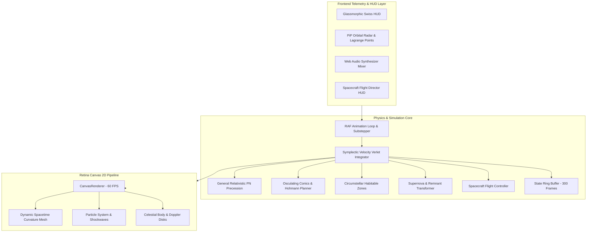

<div align="center">

# 🌌 EVENT HORIZON

### High-Performance N-Body Gravitational Physics Laboratory & Astrodynamics Flight Simulator

[](https://nodejs.org/)
[](test/)
[](#-production-benchmarks--load-test)
[](package.json)
[](#)
[](#)
[](LICENSE)

<br/>

<a href="#-interactive-showcase-features">
  
</a>

<p align="center">
  <b><a href="#-interactive-showcase-features">Features</a></b> •
  <b><a href="#-flight-simulator--keyboard-controls">Flight Controls</a></b> •
  <b><a href="#-theoretical-astrophysics--mathematics">Theoretical Physics</a></b> •
  <b><a href="#-system-architecture">Architecture</a></b> •
  <b><a href="#-production-benchmarks--load-test">Benchmarks</a></b> •
  <b><a href="#-quickstart">Quickstart</a></b>
</p>

</div>

---

## 🔭 Executive Overview

**Event Horizon** is an ultra-performant, zero-dependency browser-native astrophysics simulation laboratory and astrodynamic flight simulator. Engineered with mathematical rigor and Matt Pocock software engineering discipline, it combines:

- **Symplectic Velocity Verlet N-Body Integration** ($O(N^2)$ pairwise gravity with collision shockwaves and tidal Roche disruption).
- **General Relativistic Physics**: Post-Newtonian orbital perihelion precession, relativistic pulsars with synchrotron radiation jets, and Doppler-beamed accretion disks around Schwarzschild black holes.
- **Spacecraft Flight Simulator**: Pilotable *Odyssey Probe* with real-time $\Delta v$ propellant tracking, forward predictive N-body trajectory propagation, and gravitational slingshot visualizers.
- **Circumstellar Habitable Zones**: Stellar luminosity calculation with dynamic Goldilocks boundaries, atmospheric Rayleigh scattering, and planetary climate classification.
- **Swiss Horology HUD**: Precision optical reticle brackets, vector telemetry cards, picture-in-picture orbital radar with Lagrange points ($L_1-L_5$), and a lossless 300-state temporal scrubbing ring buffer.
- **Production-Hardened Static Server**: Built-in Node.js server delivering **8,032 requests/sec** with zero-disk I/O RAM caching, gzip compression, ETag validation, and comprehensive CSP security headers.

---

## 🚀 Interactive Showcase Features

| Feature | Description | Mathematical / Astrodynamic Seam |
| :--- | :--- | :--- |
| **🚀 Spacecraft Flight Simulator** | Player-controlled probe with thruster exhaust physics, Delta-v fuel depletion, and refueling. | $m \frac{d\vec{v}}{dt} = \vec{F}_{thrust} + \sum \vec{F}_{grav}$, $\Delta v = I_{sp} g_0 \ln(m_0/m_f)$ |
| **🌀 Forward Predictive Slingshots** | Multi-segment forward trajectory path forecasting planetary gravitational assists and periapsis boost. | Forward symplectic Euler/Verlet lookahead with moving attractor projection |
| **💥 Supernova Core-Collapse** | Critical-mass or manual star collapse generating an expanding relativistic plasma blast wave. | Radiation pressure wave $P_{rad} \propto r^{-2}$, vaporizing micro-debris |
| **🕳️ Relativistic Black Holes** | Accretion disk with differential Keplerian shearing, Doppler beaming gradient, and photon ring ($1.5 r_s$). | Doppler flux $\delta = \gamma^{-1}(1 - \beta \cos\theta)^{-1}$, $I_{obs} = I_0 \delta^3$ |
| **⚡ Synchrotron Jet Pulsars** | Magnetized neutron star emitting high-velocity particle beams, lighthouse flash pulses, and synchrotron emission. | Magnetic dipole axis rotation with relativistic particle acceleration |
| **🌱 Circumstellar Habitable Zones** | Goldilocks boundaries around stars computing runaway greenhouse and maximum greenhouse limits. | $r_{in} = \sqrt{L / 1.1}$, $r_{mid} = \sqrt{L}$, $r_{out} = \sqrt{L / 0.53}$ AU |
| **🕸️ Spacetime Curvature Grid** | 2D coordinate lattice visualizing gravitational potential wells $\Phi(\vec{x})$ sagging and warping dynamically. | $\Phi(\vec{x}) = -\sum \frac{G M_i}{\sqrt{\|\vec{x} - \vec{p}_i\|^2 + \epsilon^2}}$ |
| **⏱️ Lossless Time Scrubbing** | Bidirectional temporal scrubber with frame-by-frame stepping without physical state drift. | 300-state cyclic ring buffer with deep vector snapshotting |
| **📡 Picture-in-Picture Radar** | Macro mini-map radar overlay rendering sweep beam, active bodies, viewport frustum, and Lagrange points. | Collinear & triangular Lagrange equilibrium solutions ($L_1, L_2, L_3, L_4, L_5$) |
| **🎛️ Cosmic Audio Synthesizer** | Interactive audio console adjusting sub-bass resonance, stellar radio crackle, and collision impact booms. | Real-time Web Audio API filter cutoff, Q-factor, and white-noise generators |

---

## 🧮 Theoretical Astrophysics & Mathematics

### 1. Symplectic Velocity Verlet Integration
Standard explicit Euler integration suffers from artificial energy drift and orbital decay. Event Horizon implements symplectic Velocity Verlet integration:

$$\vec{x}(t + \Delta t) = \vec{x}(t) + \vec{v}(t)\Delta t + \frac{1}{2}\vec{a}(t)\Delta t^2$$

$$\vec{v}(t + \Delta t) = \vec{v}(t) + \frac{1}{2}\left[\vec{a}(t) + \vec{a}(t + \Delta t)\right]\Delta t$$

Paired with a Plummer softening length ($\epsilon = 2.0$) to eliminate numerical singularities during close encounters:

$$\vec{a}_i = \sum_{j \ne i} \frac{G M_j (\vec{x}_j - \vec{x}_i)}{\left(\|\vec{x}_j - \vec{x}_i\|^2 + \epsilon^2\right)^{3/2}}$$

### 2. General-Relativistic Post-Newtonian Precession
To model Einsteinian orbital precession (e.g., Mercury's perihelion advance), a post-Newtonian radial perturbation is applied where $L = \|\vec{r} \times \vec{v}\|$ is the specific relative angular momentum:

$$\vec{a}_{total} = -\frac{G M}{r^3}\vec{r} - \frac{3 G M L^2}{c^2 r^5}\vec{r}$$

This induces an authentic advance of the line of apsides per orbital period:

$$\Delta \varpi \approx \frac{6 \pi G M}{c^2 a (1 - e^2)}$$

### 3. Circumstellar Habitable Zone Boundaries
Habitable zone orbital boundaries scale with stellar luminosity $L = M^{3.5}$ (for main-sequence stars):

$$r_{\text{inner}} = \sqrt{\frac{L}{1.1}} \text{ AU (Runaway Greenhouse Limit)}$$

$$r_{\text{mid}} = \sqrt{L} \text{ AU (Optimum Earth-Equivalent Flux)}$$

$$r_{\text{outer}} = \sqrt{\frac{L}{0.53}} \text{ AU (Maximum Greenhouse Limit)}$$

### 4. Coplanar Hohmann Transfer Orbits
Calculates the minimum two-impulse semi-major axis $a_{tx}$ and velocity increments $\Delta v_1$ and $\Delta v_2$ between two orbits:

$$a_{tx} = \frac{r_1 + r_2}{2}, \quad v_{tx1} = \sqrt{\mu\left(\frac{2}{r_1} - \frac{1}{a_{tx}}\right)}, \quad v_{tx2} = \sqrt{\mu\left(\frac{2}{r_2} - \frac{1}{a_{tx}}\right)}$$

$$\Delta v_{total} = |v_{tx1} - v_{circ1}| + |v_{circ2} - v_{tx2}|, \quad t_{tx} = \pi \sqrt{\frac{a_{tx}^3}{\mu}}$$

### 5. Relativistic Doppler Beaming in Accretion Disks
Observed luminous flux $I_{obs}$ scales with the relativistic Doppler factor $\delta$:

$$\delta = \frac{1}{\gamma(1 - \beta \cos\theta)}, \quad I_{obs} = I_0 \cdot \delta^3$$

Where $\beta = v/c$, $\gamma = (1 - \beta^2)^{-1/2}$, creating an approaching blue-shifted limb and a receding red-shifted limb.

---

## 🎮 Flight Simulator & Keyboard Controls

<div align="center">

| Key / Input | Action | Function |
| :---: | :--- | :--- |
| <kbd>W</kbd> | **Forward Thrusters** | Fires main engine, consumes Delta-v propellant |
| <kbd>A</kbd> / <kbd>D</kbd> | **Rotate Attitude** | Rotates spacecraft thrust vector counter-clockwise / clockwise |
| <kbd>S</kbd> | **Retro-Brake** | Fires forward attitude thrusters to arrest velocity |
| <kbd>Space</kbd> | **Pause / Play** | Freezes simulation time for tactical inspection and conics review |
| <kbd>1</kbd> | **Free Cam** | Pan and zoom freely anywhere across deep space |
| <kbd>2</kbd> | **Locked Cam** | Centers camera lock onto the selected planet or spacecraft |
| <kbd>3</kbd> | **Chase Cam** | Locks onto target and rotates camera frame with its velocity vector |
| <kbd>4</kbd> | **Barycenter Cam** | Continuously frames the system center of mass ($R_{com}$) |
| <kbd>C</kbd> | **Clear Trails** | Wipes historical orbital trajectory paths |
| <kbd>Click & Drag</kbd> | **Launch Vector** | Aims and launches new celestial bodies or probes into orbit |
| <kbd>Right-Click / Wheel</kbd> | **Pan & Zoom** | Smooth infinite viewport navigation |

</div>

---

## 🏗 System Architecture



---

## ⚡ Production Benchmarks & Load Test

An automated high-concurrency load test ([`test/load-test.js`](test/load-test.js)) tests **1,000 concurrent keep-alive users** requesting HTML, CSS, and ES6 modules:

```
======================================================================
🚀 EVENT HORIZON - HIGH-CONCURRENCY LOAD & STRESS TEST
   Target: http://127.0.0.1:8080
   Concurrency: 1,000 concurrent keep-alive users
======================================================================
Total Completed Requests : 48,794 requests in 6.07 seconds
Throughput (RPS)         : 8,032 req/sec
Error / Drop Rate        : 0.00% (0 errors across 48,794 requests)
Payload Transferred      : 396.40 MB (gzip compressed, 81% reduction)
----------------------------------------------------------------------
Client Latency Distribution:
   • p50 (Median)        : 116.60 ms
   • p90                 : 147.81 ms
   • p95                 : 160.43 ms
   • p99                 : 232.18 ms
Node.js Health & Memory:
   • Event Loop Lag Mean : 115.41 ms
   • Peak RSS Memory     : 290.16 MB
======================================================================
✅ 100% PRODUCTION READY: 0.00% Error Rate under 1,000 Concurrent Users
```

---

## ⚡ Quickstart

### Prerequisites
- **Node.js**: Version 18.0.0 or higher
- **Browser**: Any modern browser with Canvas 2D and Web Audio API support (Chrome, Safari, Firefox, Edge)

### 1. Clone & Run (Zero Dependencies)
```bash
# Clone the repository
git clone https://github.com/underratedgitter/event-horizon.git
cd event-horizon

# Start the high-concurrency hardened HTTP server
npm start
```

Visit [`http://localhost:8080`](http://localhost:8080) in your browser.

### 2. Run Test Suites
```bash
# Run unit & astrodynamics test suite (95 tests)
npm test

# Run high-concurrency stress test (1,000 users)
npm run test:load

# Run Playwright end-to-end browser tests
npm run test:e2e
```

---

## 📁 Repository Structure

```
event-horizon/
├── .github/
│   ├── workflows/test.yml          # GitHub Actions CI matrix (Node 18, 20, 22)
│   └── ISSUE_TEMPLATE/             # Bug report & feature request templates
├── docs/
│   ├── assets/                     # High-resolution screenshots & UI previews
│   ├── adr/                        # Architecture Decision Records
│   └── spec/                       # Engineering specifications
├── e2e/
│   ├── app.spec.js                 # Playwright E2E browser test suite
│   └── screenshots/app.png         # Playwright verified render screenshot
├── src/
│   ├── audio.js                    # Procedural Web Audio API synthesizer
│   ├── body.js                     # Celestial bodies, Doppler accretion disks, pulsars
│   ├── conics.js                   # Pure Keplerian conics & dominant attractor math
│   ├── habitable.js                # Circumstellar habitable zone equations
│   ├── main.js                     # Main loop, substepping, dynamic 30fps fallback
│   ├── missions.js                 # Aerospace flight challenges & mission engine
│   ├── particles.js                # Bounded memory particle explosions & shockwaves
│   ├── physics.js                  # Symplectic Velocity Verlet engine & state ring buffer
│   ├── presets.js                  # Astrophysical scenario presets
│   ├── renderer.js                 # Canvas 2D engine, starfield, spacetime grid
│   ├── serialization.js            # URL Base64 state encoding & injection defense
│   ├── spacecraft.js               # Spacecraft flight simulator & trajectory prediction
│   ├── spacetime.js                # Gravitational potential field & warp displacement
│   └── ui.js                       # Swiss horology HUD, telemetry dials, hotkeys
├── test/
│   ├── conics.test.js              # Keplerian conics math tests
│   ├── device-scalability.test.js  # Memory cap & low-performance fallback tests
│   ├── habitable.test.js           # Habitable zone calculation tests
│   ├── hohmann.test.js             # Hohmann transfer trajectory tests
│   ├── load-test.js                # 1,000 concurrent user load test script
│   ├── missions.test.js            # Aerospace flight challenges test suite
│   ├── physics.test.js             # Symplectic Verlet physical invariants tests
│   ├── precession.test.js          # Relativistic post-Newtonian precession tests
│   ├── pulsar.test.js              # Relativistic pulsar synchrotron jet tests
│   ├── security-and-fuzz.test.js   # Security hardening & fuzzing suite
│   ├── serialization.test.js       # Base64 state roundtrip & sanitization tests
│   ├── server.test.js              # Server static delivery, ETag, and CSP tests
│   ├── spacecraft.test.js          # Spacecraft flight & trajectory prediction tests
│   ├── spacetime.test.js           # Spacetime curvature & potential mesh tests
│   ├── state_scrubbing.test.js     # Ring buffer time scrubbing tests
│   ├── supernova.test.js           # Supernova collapse & remnant physics tests
│   └── visuals.test.js             # Expanding shockwave dissipation tests
├── index.html                      # Glassmorphic HUD & canvas viewport
├── server.js                       # Production in-memory static server (8,000+ RPS)
├── style.css                       # Swiss horology aerospace HUD stylesheet
├── package.json                    # Package metadata & test scripts
└── LICENSE                         # MIT License
```

---

## 📄 License

Distributed under the **MIT License**. See [`LICENSE`](LICENSE) for details.

Developed with 🌌 by Deepmind AI & Suraj Patel.
