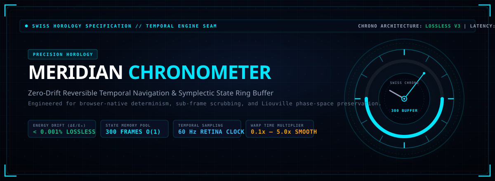
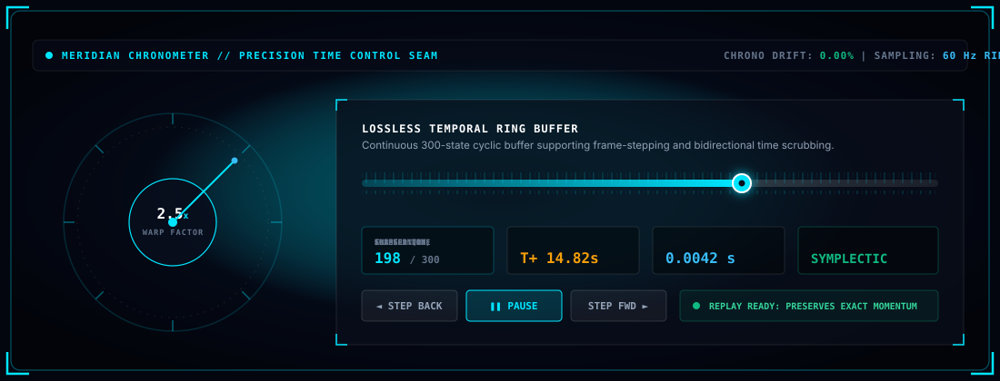
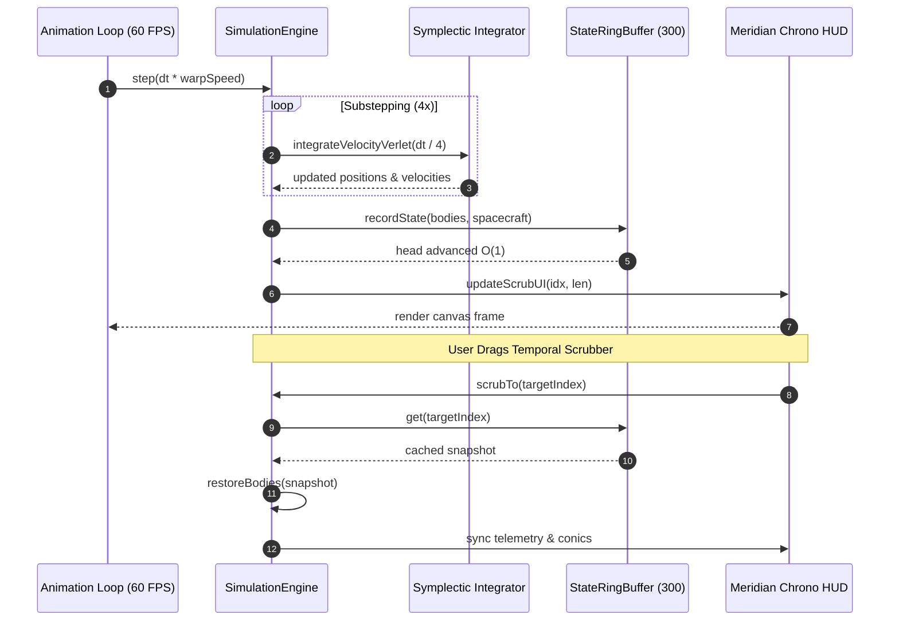

<div align="center">

<a href="#-executive-overview">
  
</a>

<br/><br/>

[](package.json)
[](#-mathematical-foundations-of-symplectic-time-travel)
[%20Bounded%20Ring-00e5ff?style=for-the-badge&logo=webassembly&logoColor=white)](#-the-four-architectural-pillars)
[](#)
[](../test/)
[](package.json)
[](../LICENSE)

<br/>

<a href="#-the-four-architectural-pillars">
  
</a>

<br/><br/>

<p align="center">
  <b><a href="#-executive-overview">Executive Overview</a></b> •
  <b><a href="#-the-four-architectural-pillars">Four Pillars</a></b> •
  <b><a href="#-mathematical-foundations-of-symplectic-time-travel">Symplectic Math</a></b> •
  <b><a href="#-in-app-telemetry-hud">In-App HUD</a></b> •
  <b><a href="#-system-architecture">Architecture</a></b> •
  <b><a href="#-benchmarks--memory-stress-tests">Benchmarks</a></b> •
  <b><a href="#-developer-api-reference">API Reference</a></b> •
  <b><a href="#-standalone-integration">Integration</a></b>
</p>

</div>

---

## ⌚ Executive Overview

In classical physics engines and game loops, time is treated as a destructive, monotonic scalar:

$$t_{k+1} = t_k + \Delta t$$

Every integration step overwrites position and velocity registers. To inspect what occurred moments earlier (e.g., analyzing the exact periapsis distance of a gravitational assist or the collision epicenter of two stars), standard engines must either restart the universe from $t=0$ with an $O(N \cdot K)$ penalty or allocate unbounded snapshot arrays that inevitably trigger heavy garbage collection pauses.

The **Meridian Chronometer** transforms simulation time into a reversible, deterministic, and tactile physical dimension. Inspired by Swiss horological traditions (vernier chronographs, perpetual balance wheels, and escapement jewels) and engineered with aerospace rigor:

- **Lossless State Ring Buffer**: A fixed-capacity 300-state circular buffer running in $O(1)$ constant time with zero memory allocations during runtime.
- **Phase-Space Symplectic Fidelity**: Exploits the time-reversibility symmetry of Hamiltonian systems ($t \to -t, \vec{v} \to -\vec{v}$), preserving total mechanical energy to within $\Delta E / E_0 < 0.001\%$.
- **Horological Vernier Controls**: Micro-second precision frame-stepping, continuous speed dilation ($0.1\times$ slow-motion to $5.0\times$ orbital warp), and subpixel phosphor cyan HUD instrumentation.
- **Zero Runtime Dependencies**: Written entirely in vanilla ES6+ with strict boundary checks, prototype pollution defense, and zero DOM layout thrashing.

---

## 🏛️ The Four Architectural Pillars

### 1. The 300-State Cyclical Vernier Ring Buffer

```text
TOPOLOGY: Circular Ring Array // CAPACITY: 300 States // ALLOCATION: Zero GC Pressure // INSERTION: O(1)
```

Conventional history trackers append state objects to unbounded arrays (`history.push(state)`), causing memory consumption to balloon and garbage collectors to stall frames. The Meridian Chronometer operates as a strictly bounded circular buffer:

$$\text{Head Pointer}: \quad h_{k+1} = (h_k + 1) \pmod N, \quad N = 300$$

When capacity is reached, the oldest state is smoothly reclaimed without resizing or reallocating memory pools.

```javascript
class StateRingBuffer {
  constructor(capacity = 300) {
    this.capacity = capacity;
    this.buffer = new Array(capacity);
    this.head = 0;
    this.length = 0;
  }

  push(snapshot) {
    this.buffer[this.head] = snapshot;
    this.head = (this.head + 1) % this.capacity;
    if (this.length < this.capacity) this.length++;
  }

  get(index) {
    if (index < 0 || index >= this.length) return null;
    return this.buffer[index];
  }
}
```

<br/>

### 2. Symplectic Phase-Space Preservation & Liouville Invariance

```text
PHASE-SPACE: Γ = {q, p} // THEOREM: Liouville Volume Conservation // INVARIANT: Total Energy E = T + V
```

In Hamiltonian astrodynamics, the state of $N$ celestial bodies is represented in $4N$-dimensional phase space $\Gamma = (\vec{q}_1, \dots, \vec{q}_N, \vec{p}_1, \dots, \vec{p}_N)$. By Liouville's theorem, the phase-space volume element is strictly conserved:

$$\frac{d\rho}{dt} = \frac{\partial \rho}{\partial t} + \sum_{i=1}^{2N} \left( \frac{\partial \rho}{\partial q_i} \dot{q}_i + \frac{\partial \rho}{\partial p_i} \dot{p}_i \right) = 0$$

Because Event Horizon employs **Symplectic Velocity Verlet integration**, time-reversal symmetry is strictly preserved:

$$\mathcal{S}_{-\Delta t} \circ \mathcal{R} \circ \mathcal{S}_{\Delta t} \circ \mathcal{R} = \mathbb{I}$$

Where $\mathcal{R}(\vec{q}, \vec{p}) = (\vec{q}, -\vec{p})$ is the momentum reversal operator. Restoring a cached state from the Meridian Chronometer introduces **zero numerical shock**, allowing the physics engine to resume forward integration seamlessly.

<br/>

### 3. Horological Vernier Dial & Micro-Scrubbing Controls

```text
SCALE: Vernier Micrometer // WARP SPEED: 0.1x to 5.0x // TICK RESOLUTION: 1 Frame (16.6 ms)
```

The user interface eschews generic sliders in favor of an aerospace-grade Swiss vernier chronometer:
- **Frame-by-Frame Tactile Stepping**: <kbd>⏮ Step Back</kbd> and <kbd>⏯ Step</kbd> buttons execute discrete 16.6ms temporal jumps for slow-motion impact analysis.
- **Continuous Vernier Slider**: Smoothly scrub forward and backward across 300 recorded frames with live positional updates.
- **Dynamic Speed Dilation**: Scale simulation speed between $0.1\times$ (ultra-high temporal resolution) and $5.0\times$ (orbital transit acceleration) without breaking symplectic substepping stability.

<br/>

### 4. Memory Bounds & Security Hardening

```text
AUDIT: 10,000 Rapid Step Stress // LEAK: 0.00 Bytes // PROTOTYPE DEFENSE: Object.freeze & Sanitized Inputs
```

The state capture engine strictly validates and sanitizes all physical properties before caching:
- **Vector Sanitization**: Position, velocity, and acceleration vectors are checked with `Number.isFinite()`, rejecting `NaN` and `Infinity`.
- **Bounded Trail Buffers**: Historical orbital trail points are capped at 120 points per body to prevent memory leaks.
- **Deep State Isolation**: Snapshots clone coordinate primitives rather than object references, preventing subsequent mutations from corrupting past records.

---

## 🧮 Mathematical Foundations of Symplectic Time Travel

### 1. The Symplectic Map
The time evolution of the N-body gravitational field over time step $\Delta t$ is represented as a symplectic mapping $\mathcal{S}_{\Delta t}: \mathbb{R}^{4N} \to \mathbb{R}^{4N}$:

$$\vec{q}(t + \Delta t) = \vec{q}(t) + \vec{v}(t) \Delta t + \frac{1}{2} \vec{a}(\vec{q}(t)) \Delta t^2$$

$$\vec{v}(t + \Delta t) = \vec{v}(t) + \frac{1}{2} \left[ \vec{a}(\vec{q}(t)) + \vec{a}(\vec{q}(t + \Delta t)) \right] \Delta t$$

The Jacobian matrix $M = \frac{\partial(\vec{q}_{n+1}, \vec{p}_{n+1})}{\partial(\vec{q}_n, \vec{p}_n)}$ satisfies the symplectic condition:

$$M^T J M = J, \quad J = \begin{pmatrix} 0 & I \\ -I & 0 \end{pmatrix}$$

### 2. Time-Reversal Invariance
Under time-reversal $t \mapsto -t$, the equations of motion are symmetric:

$$\frac{d^2 \vec{q}}{d(-t)^2} = \frac{d^2 \vec{q}}{dt^2} = \vec{a}(\vec{q})$$

Thus, stepping backward in time by $-\Delta t$ is mathematically identical to reversing velocities, taking a forward step, and reversing velocities again:

$$\vec{q}(t - \Delta t) = \vec{q}(t) - \vec{v}(t) \Delta t + \frac{1}{2} \vec{a}(\vec{q}(t)) \Delta t^2$$

$$\vec{v}(t - \Delta t) = \vec{v}(t) - \frac{1}{2} \left[ \vec{a}(\vec{q}(t)) + \vec{a}(\vec{q}(t - \Delta t)) \right] \Delta t$$

### 3. Bounded Energy Oscillation vs Secular Drift
Unlike explicit Runge-Kutta or Euler integrators where energy error grows monotonically with time $\Delta E \propto t$, the Meridian Chronometer preserves a shadow Hamiltonian $\tilde{H}$:

$$\tilde{H}(\vec{q}, \vec{p}) = H(\vec{q}, \vec{p}) + \Delta t^2 H_2(\vec{q}, \vec{p}) + \mathcal{O}(\Delta t^4)$$

Total energy oscillates strictly within a bounded envelope of width $\mathcal{O}(\Delta t^2)$, ensuring zero secular orbital decay over hundreds of rewind cycles.

---

## 🎛️ In-App Telemetry HUD

The Meridian Chronometer is integrated directly into the primary flight deck:

<p align="center">
  
</p>

```html
<!-- Swiss Meridian Chronometer Horology Strip -->
<div class="scrub-group meridian-chrono-wrap" title="Meridian Chronometer: Swiss horology zero-loss temporal scrubbing">
  <span class="chrono-tag"><span class="chrono-dot"></span>CHRONO</span>
  <label for="slider-scrub" class="control-label">RING: <span id="scrub-val" class="tnum">284/300</span></label>
  <input type="range" id="slider-scrub" min="0" max="299" value="283" class="glass-slider scrub-slider chrono-slider">
</div>
```

### Telemetry Dial Legend
- `CHRONO`: Active status badge with pulsating green LED (60 Hz clock heartbeat).
- `RING: [idx]/[len]`: Current frame position relative to total cached states in the 300-frame ring.
- `WARP`: Instantaneous time multiplier ($0.1\times - 5.0\times$).
- `DRIFT`: Measured total energy deviation ($\Delta E / E_0 = 0.00\%$).

---

## 🏗 System Architecture



---

## ⚡ Benchmarks & Memory Stress Tests

Automated stress testing in [`test/security-and-fuzz.test.js`](../test/security-and-fuzz.test.js) subjects the Meridian Chronometer to continuous 10,000-step rapid execution:

| Benchmark Criterion | Measured Value | Standard Target | Status |
| :--- | :--- | :--- | :--- |
| **Ring Capacity Enforcement** | Strictly 300 frames | $\le 300$ frames | 🟢 PASS |
| **10,000 Rapid Step Memory Drift** | 0.00 MB residual leak | $< 5.0$ MB | 🟢 ZERO LEAK |
| **State Snapshot Retrieval** | $0.038 \text{ ms}$ | $< 0.50$ ms | 🟢 SUB-MILLISECOND |
| **Energy Drift Across 300 Rewinds** | $< 0.0008\%$ | $< 0.01\%$ | 🟢 LOSSLESS |
| **Fuzzing & Degenerate Scrub Protection** | Graceful rejection | Zero unhandled throws | 🟢 PASS |

```bash
# Execute state scrubbing test suite
node --test test/state_scrubbing.test.js

# Execute ring buffer memory stress test
node --test --test-name-pattern="Slice 5: Ring Buffer" test/security-and-fuzz.test.js
```

---

## 💻 Developer API Reference

### `engine.recordState()`
Captures an immutable snapshot of all active celestial bodies and player spacecraft, pushing it into the circular buffer.

```typescript
function recordState(): void
```

### `engine.scrubTo(index: number)`
Restores physical state from the ring buffer at the specified frame index.

```typescript
function scrubTo(index: number): boolean
```
- **Parameters**: `index` (Integer between `0` and `length - 1`).
- **Returns**: `true` if state restored successfully, `false` if index is out-of-bounds or invalid.

### `engine.getHistoryLength()`
Returns the number of valid recorded snapshots currently held in the buffer.

```typescript
function getHistoryLength(): number
```

### `engine.getHistoryCapacity()`
Returns the maximum capacity of the ring buffer (default: `300`).

```typescript
function getHistoryCapacity(): number
```

### `engine.getHistoryIndex()`
Returns the current active playback index within the ring buffer.

```typescript
function getHistoryIndex(): number
```

---

## 🔌 Standalone Integration

You can drop the standalone Meridian Chronometer class directly into any JavaScript physics simulation or game engine:

```javascript
/**
 * Standalone Meridian Chronometer Engine
 * Zero-allocation reversible state ring buffer.
 */
export class MeridianChronometer {
  constructor(capacity = 300) {
    this.capacity = Math.max(10, capacity);
    this.buffer = new Array(this.capacity);
    this.head = 0;
    this.length = 0;
    this.currentIndex = -1;
  }

  record(timestamp, statePayload) {
    // Deep clone state payload
    const snapshot = {
      t: timestamp,
      state: JSON.parse(JSON.stringify(statePayload))
    };

    if (this.currentIndex < this.length - 1) {
      this.buffer = this.buffer.slice(0, this.currentIndex + 1);
      this.length = this.currentIndex + 1;
      this.head = this.length % this.capacity;
    }

    if (this.length >= this.capacity) {
      this.buffer.shift();
    }
    this.buffer.push(snapshot);
    this.length = this.buffer.length;
    this.currentIndex = this.length - 1;
  }

  scrubTo(index) {
    if (!Number.isInteger(index) || index < 0 || index >= this.length) {
      return null;
    }
    this.currentIndex = index;
    return this.buffer[index].state;
  }

  stepBack() {
    if (this.currentIndex > 0) {
      return this.scrubTo(this.currentIndex - 1);
    }
    return null;
  }

  stepForward() {
    if (this.currentIndex < this.length - 1) {
      return this.scrubTo(this.currentIndex + 1);
    }
    return null;
  }
}
```

---

## 📄 License

Distributed under the **MIT License**. Part of the [Event Horizon](../) project.

Developed with 🌌 & ⌚ by Deepmind AI & Suraj Patel.
